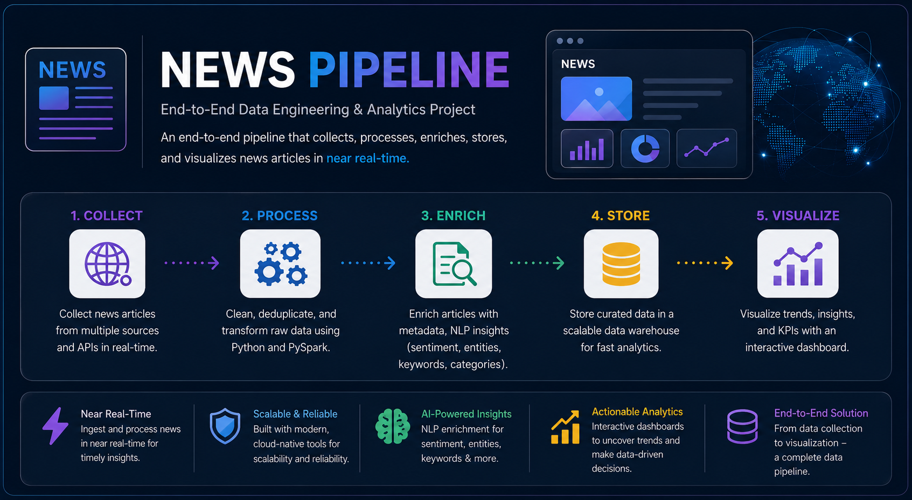
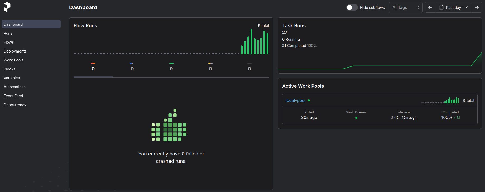
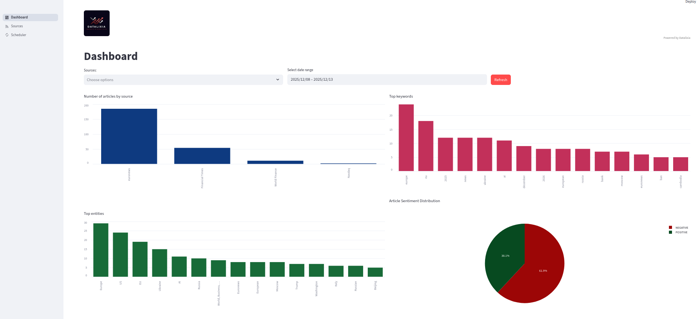

# 📰 News Pipeline – End-to-End Data Engineering Project



## 📌 Overview

**News Pipeline** is an end-to-end data engineering and analytics project designed to **collect, process, enrich, store, and visualize news articles** in near real-time.

The pipeline extracts articles from multiple **RSS news feeds**, schedules extraction jobs using **Prefect**, streams data through **Apache Kafka**, enriches articles using **Machine Learning (NLP)**, stores results in **Elasticsearch**, and finally exposes insights through an interactive **Streamlit dashboard**.

This project demonstrates real-world concepts such as:

* Data ingestion & streaming
* Distributed messaging with Kafka
* Workflow orchestration
* NLP-based enrichment (sentiment, keywords, entities)
* Search & analytics with Elasticsearch
* Interactive data visualization

---
## ⚙️ Tech Stack

| Layer                       | Technology                                  |
| --------------------------- | ------------------------------------------- |
| Ingestion                   | RSS, Python                                 |
| Orchestration               | Prefect                                     |
| Messaging                   | Apache Kafka                                |
| Processing                  | Python                                      |
| ML / NLP                    | Sentiment Analysis, Keyword Extraction, NER |
| Storage                     | Elasticsearch                               |
| Visualization               | Streamlit                                   |
| Containerization            | Docker                                      |

---

## 🔄 Pipeline Workflow

### 1️⃣ RSS News Extraction

* News articles are collected from **multiple RSS feeds** (configurable sources).
* Each article includes:

  * Title
  * Description / Content
  * Publication date
  * Source name
  * Source URL

Extraction logic ensures:

* Deduplication (no repeated articles)
* Proper date parsing
* Source attribution

---

### 2️⃣ Workflow Scheduling with Prefect




* **Prefect** is used to orchestrate and schedule the extraction process.
* Supports:

  * Manual runs
  * Scheduled runs (cron-like)
  * Monitoring & retries

From the Streamlit app, users can:

* Trigger extraction jobs manually
* Monitor job execution status

---

### 3️⃣ Kafka Producer

* Extracted articles are serialized (JSON) and pushed to **Apache Kafka**.
* Kafka acts as a **buffer and decoupling layer** between ingestion and processing.

Benefits:

* Scalability
* Fault tolerance
* Asynchronous processing

---

### 4️⃣ Kafka Consumer & Data Enrichment

* Kafka consumers read articles from the topic.
* Each article is enriched using **Machine Learning & NLP techniques**:

#### 🔍 Enrichment Features

* **Sentiment Analysis**

  * Positive / Negative

* **Keyword Extraction**

  * Top relevant keywords per article

* **Named Entity Recognition (NER)**

  * People
  * Organizations
  * Locations

This enrichment transforms raw news into **analytics-ready data**.

---

### 5️⃣ Elasticsearch Storage

* Enriched articles are indexed into **Elasticsearch**.
* Supports:

  * Full-text search
  * Filtering
  * Aggregations
  * Time-based analytics

Each document typically contains:

* Article metadata
* NLP results
* Source information
* Timestamps

---

## 📊 Streamlit Dashboard




The Streamlit application is the **user-facing layer** of the project.

### 🔹 Features

#### 📈 Interactive Analytics

* Articles over time
* Sentiment distribution
* Top keywords
* Most mentioned entities
* Source-based analytics

#### 🔎 Filters

* Date range
* News source


#### 🗂️ Source Management

* Add new RSS feed URLs
* Edit or delete existing sources

#### ⏱️ Pipeline Control

* Trigger the scheduler manually
* Monitor ingestion status

---

## 🧠 Machine Learning & NLP

The project uses NLP models to enrich textual data:

* **Sentiment Analysis** – Understand public opinion and tone
* **Keyword Extraction** – Identify key topics
* **NER** – Extract structured knowledge from unstructured text


---


## 🚀 Getting Started

### Prerequisites

* Python 3.9+
* Apache Kafka
* Elasticsearch
* Prefect
* Docker (optional)

### Installation

```bash
git clone https://github.com/sarrarmohcin/news-pipeline.git
cd news-pipeline
```

---

## ▶️ Running the Project

Start all docker containers 

```bash
./run.sh
```

Access dashboard on http://localhost:8501/


---

## 📌 Use Cases

* Media monitoring
* Brand sentiment analysis
* Trend detection
* News aggregation platforms
* Data engineering & ML portfolio project

---

## 🤝 Contributing

Contributions are welcome!
Feel free to open issues or submit pull requests.


